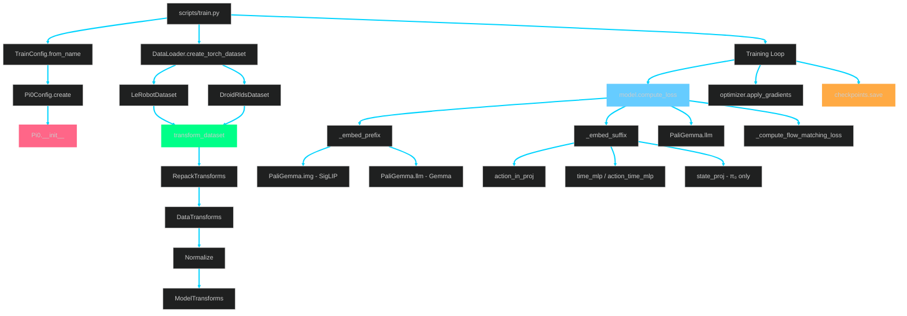
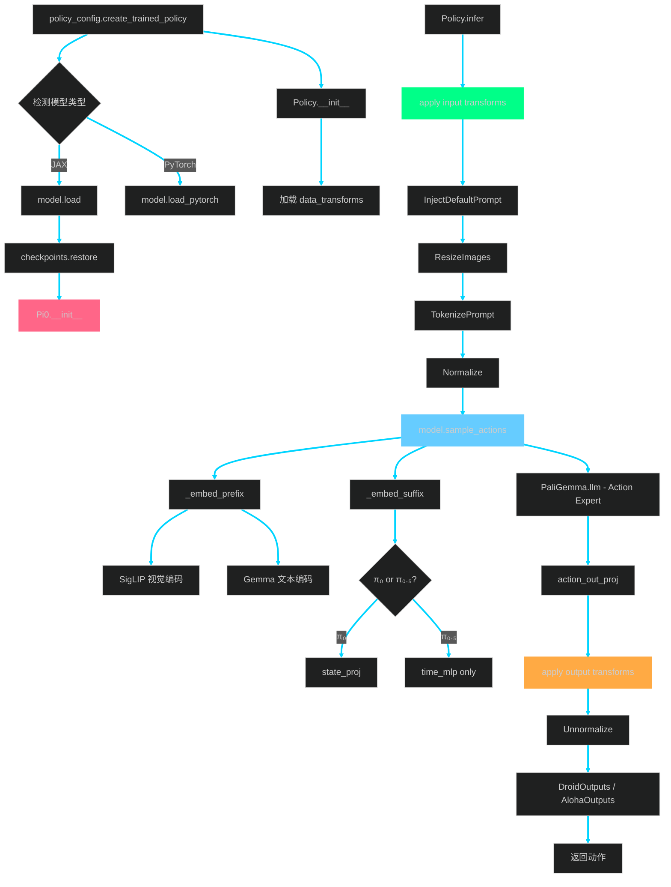
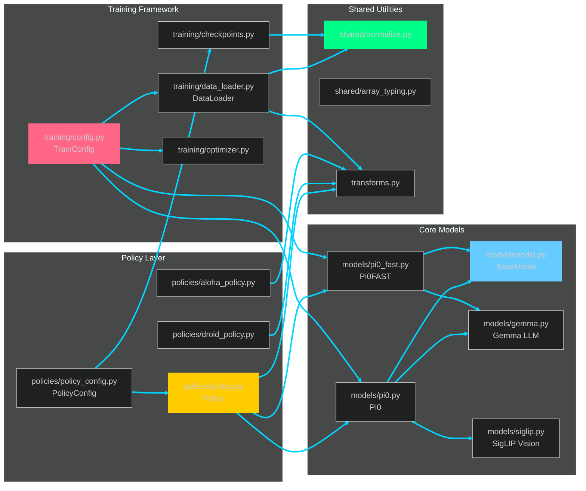
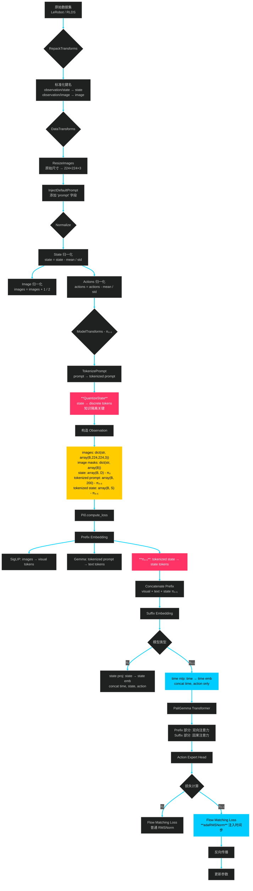
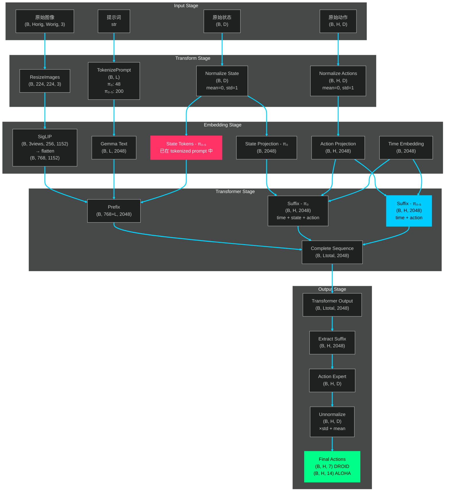
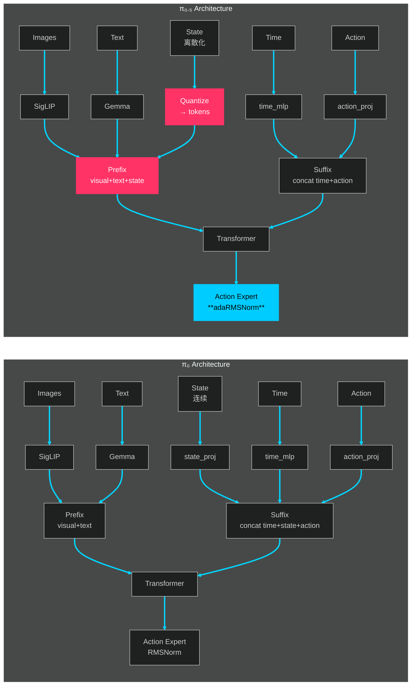
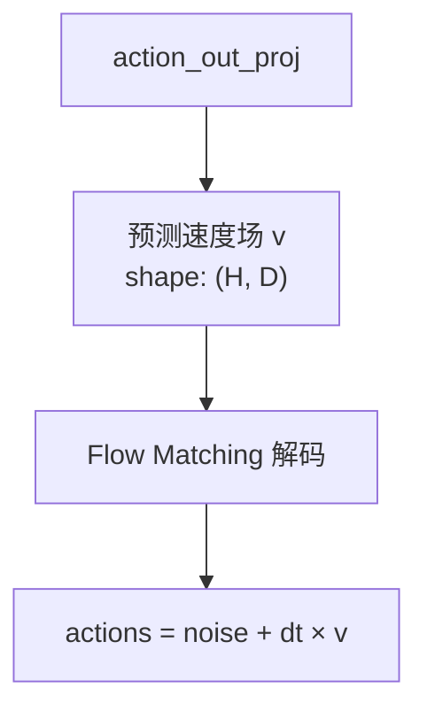

# OpenPI 架构可视化文档

## 一、π₀.₅ 实现说明

### π₀.₅ vs π₀ 的关键区别

**位置**: `src/openpi/models/pi0_config.py` 和 `src/openpi/models/pi0.py`

**配置参数**:
```python
Pi0Config(pi05=True)  # 启用 π₀.₅
```

**两个核心差异**:

1. **状态输入方式** (`pi0_config.py:28-30`):
   - **π₀**: 状态是连续输入，作为 suffix 的一部分
   - **π₀.₅**: 状态是离散语言 token 的一部分（知识隔离）

2. **时间步注入方式** (`pi0.py:77,94-99`):
   - **π₀**: 普通的流匹配
   - **π₀.₅**: 使用 adaRMSNorm 注入流匹配时间步

**代码实现** (`pi0.py:93-99`):
```python
if config.pi05:
    # π₀.₅: 使用简单的时间 MLP
    self.time_mlp_in = nnx.Linear(width, width)
    self.time_mlp_out = nnx.Linear(width, width)
else:
    # π₀: 使用状态投影 + 时间 MLP
    self.state_proj = nnx.Linear(action_dim, width)
    self.action_time_mlp_in = nnx.Linear(2 * width, width)
    self.action_time_mlp_out = nnx.Linear(width, width)
```

---

## 二、完整调用图

### 2.1 训练流程调用图



### 2.2 推理流程调用图



### 2.3 模块依赖图



---

## 三、完整数据流可视化

### 3.1 训练时数据流（π₀.₅ 示例）



### 3.2 推理时数据流（DROID 机器人示例）

```mermaid
%%{init: {'theme':'dark', 'themeVariables': { 'primaryColor':'#1e1e1e','primaryTextColor':'#fff','primaryBorderColor':'#00d4ff','lineColor':'#00d4ff','secondaryColor':'#2a2a2a','tertiaryColor':'#333'}}}%%
flowchart TD
    Start[机器人观测] --> A1[原始输入字典]
    A1 --> A2["observation/exterior_image_1_left: (480,640,3)<br/>observation/wrist_image_left: (480,640,3)<br/>observation/state: (8)<br/>task: str"]

    A2 --> B1{DroidInputs Transform}
    B1 --> B2[重映射键名]
    B2 --> B3["images:<br/>  base_0_rgb: exterior_image<br/>  left_wrist_0_rgb: wrist_image<br/>  right_wrist_0_rgb: zeros<br/>image_masks:<br/>  base_0_rgb: True<br/>  left_wrist_0_rgb: True<br/>  right_wrist_0_rgb: False<br/>state: (8)<br/>prompt: task"]

    B3 --> C1{InjectDefaultPrompt}
    C1 --> C2[如果 prompt 为空<br/>添加默认提示]

    C2 --> D1{ResizeImages}
    D1 --> D2["所有图像 resize 到<br/>224×224×3"]

    D2 --> E1{TokenizePrompt}
    E1 --> E2{模型类型}
    E2 -->|π₀| E3["tokenized_prompt: (48)<br/>max_token_len=48"]
    E2 -->|π₀.₅| E4["tokenized_prompt: (200)<br/>**包含 state tokens**<br/>max_token_len=200"]

    E4 --> F1{Normalize}
    F1 --> F2["state_normalized = <br/>  state - mean / std<br/>images_normalized = <br/>  images + 1 / 2"]

    F2 --> G1[构造 Observation 对象]
    G1 --> G2["Observation(<br/>  images: dict(3 views),<br/>  image_masks: dict(3 views),<br/>  state: (8),  # π₀<br/>  tokenized_prompt: (48/200)<br/>)"]

    G2 --> H1[model.sample_actions]

    H1 --> I1[Prefix Embedding]
    I1 --> I2["SigLIP: 3×224×224×3 → 3×256×1152"]
    I2 --> I3["Flatten: → 768×1152"]
    I3 --> I4["Gemma: tokenized_prompt → text_emb"]
    I4 --> I5{π₀.₅?}
    I5 -->|Yes| I6["**State 已在 prompt 中编码**<br/>无需额外处理"]
    I5 -->|No| I7["state 将在 suffix 中处理"]

    I6 --> J1["Concatenate Prefix<br/>visual_tokens + text_tokens + state_tokens_π₀.₅"]

    J1 --> K1["Suffix Embedding"]
    K1 --> K2["初始化噪声动作<br/>noise ~ N(0, I)"]
    K2 --> K3["采样时间步<br/>t ~ U(0, 1)"]
    K3 --> K4{模型类型}
    K4 -->|π₀| K5["time_emb = time_mlp<br/>state_emb = state_proj<br/>action_emb = action_proj<br/>concat all"]
    K4 -->|π₀.₅| K6["**time_emb = time_mlp**<br/>action_emb = action_proj<br/>concat time + action"]

    K6 --> L1["PaliGemma Transformer"]
    L1 --> L2["Prefix: 双向注意力<br/>Suffix: 因果注意力"]
    L2 --> L3{π₀.₅?}
    L3 -->|Yes| L4["**Action Expert with adaRMSNorm**<br/>时间步通过 adaRMSNorm 调制"]
    L3 -->|No| L5["Action Expert with RMSNorm"]

    L4 --> M1["action_out_proj"]
    M1 --> M2["预测速度场 v<br/>shape: (H, D)"]

    M2 --> N1["Flow Matching 解码"]
    N1 --> N2["actions = noise + dt × v"]

    N2 --> O1{Unnormalize}
    O1 --> O2["actions = <br/>  actions × std + mean"]

    O2 --> P1{DroidOutputs Transform}
    P1 --> P2["提取前 7 维<br/>actions: (H, 32) → (H, 7)"]

    P2 --> Q1["返回动作字典"]
    Q1 --> Q2["actions: (H, 7)<br/>policy_timing: dict<br/>raw_actions: (H, 32)"]

    Q2 --> End[机器人执行]

    %% 加粗线条样式
    linkStyle default stroke-width:3px,stroke:#00d4ff

    %% 深色背景适配的节点颜色
    style E4 fill:#ff3366,color:#fff,stroke:#ff3366,stroke-width:4px
    style I6 fill:#ff3366,color:#fff,stroke:#ff3366,stroke-width:4px
    style K6 fill:#00ccff,color:#000,stroke:#00ccff,stroke-width:4px
    style L4 fill:#00ccff,color:#000,stroke:#00ccff,stroke-width:4px
    style G2 fill:#ffcc00,color:#000,stroke:#ffcc00,stroke-width:4px
    style Q2 fill:#00ff88,color:#000,stroke:#00ff88,stroke-width:4px
```



### 3.3 数据形状变换详解



---

## 四、π₀ vs π₀.₅ 对比

### 4.1 架构差异



### 4.2 关键代码位置对比表

| 特性 | π₀ | π₀.₅ | 文件位置 |
|------|-----|------|---------|
| **配置参数** | `pi05=False` | `pi05=True` | `models/pi0_config.py:31` |
| **max_token_len** | 48 | 200 | `models/pi0_config.py:37` |
| **discrete_state_input** | False | True | `models/pi0_config.py:39` |
| **State 处理** | suffix 连续输入 | prefix 离散 token | `models/pi0.py:97-99` |
| **Time MLP** | `action_time_mlp_in/out` | `time_mlp_in/out` | `models/pi0.py:94-99` |
| **adaRMSNorm** | 否 | 是 | `models/gemma.py` + `pi0.py:77` |
| **Suffix 长度** | time+state+action | time+action | `models/pi0.py:162-180` |

---

## 五、关键代码片段索引

### 5.1 π₀.₅ 初始化 (pi0.py:93-99)
```python
if config.pi05:
    # π₀.₅: 简化的时间步投影（不包含 state）
    self.time_mlp_in = nnx.Linear(action_expert_config.width, action_expert_config.width, rngs=rngs)
    self.time_mlp_out = nnx.Linear(action_expert_config.width, action_expert_config.width, rngs=rngs)
else:
    # π₀: 包含 state 投影
    self.state_proj = nnx.Linear(config.action_dim, action_expert_config.width, rngs=rngs)
    self.action_time_mlp_in = nnx.Linear(2 * action_expert_config.width, action_expert_config.width, rngs=rngs)
    self.action_time_mlp_out = nnx.Linear(action_expert_config.width, action_expert_config.width, rngs=rngs)
```

### 5.2 Prefix 构造 (pi0.py:109-143)
```python
def _embed_prefix(self, observation: Observation):
    # 1. 视觉编码
    img_embeds = [self.PaliGemma.img(img) for img in images]

    # 2. 文本编码
    text_embeds, text_mask = self.PaliGemma.llm(
        observation.tokenized_prompt,
        observation.tokenized_prompt_mask,
        expert_id=0,
    )

    # 3. Concatenate (π₀.₅ 的 state 已在 tokenized_prompt 中)
    prefix_embeds = jnp.concatenate([*img_embeds, text_embeds], axis=1)
    return prefix_embeds, prefix_mask
```

### 5.3 Suffix 构造 (pi0.py:162-180)
```python
if self.pi05:
    # π₀.₅: time + action
    time_emb = self.time_mlp_out(jax.nn.gelu(self.time_mlp_in(time_emb)))
    action_emb = self.action_in_proj(actions)
    suffix_embeds = time_emb[:, None, :] + action_emb
else:
    # π₀: time + state + action
    time_emb = jnp.broadcast_to(time_emb[:, None, :], action_emb.shape)
    state_emb = jnp.broadcast_to(self.state_proj(observation.state)[:, None, :], action_emb.shape)
    stacked = jnp.concatenate([time_emb, state_emb], axis=-1)
    suffix_embeds = action_emb + self.action_time_mlp_out(jax.nn.gelu(self.action_time_mlp_in(stacked)))
```

---

## 六、使用这些可视化的建议

1. **先看数据流图 (3.2)** - 理解数据如何从机器人流向模型
2. **再看调用图 (2.1, 2.2)** - 理解函数之间的调用关系
3. **最后看模块依赖图 (2.3)** - 理解整体架构

**调试建议**:
- 在 `Policy.infer()` 入口处打印数据形状
- 在 `_embed_prefix()` 和 `_embed_suffix()` 中打印中间形状
- 对比 π₀ 和 π₀.₅ 的 suffix 长度差异

**扩展阅读**:
- `models/pi0.py:162-180` - Suffix 构造的完整逻辑
- `training/config.py:pi05_libero` - π₀.₅ 的完整配置
- `policies/policy_config.py:create_trained_policy` - 推理策略创建

---

## 七、Mermaid 图表语法修复说明

### 7.1 问题根本原因

**核心问题**：Mermaid 解析器将方括号 `[]` 内的圆括号 `()` 误判为节点形状定义符号。

#### Mermaid 节点形状语法

在 Mermaid 中，不同的括号用于定义不同形状的节点：

```mermaid
A[矩形节点]              # 方括号 [] = 矩形
B(圆角矩形)              # 圆括号 () = 圆角矩形
C{菱形判断}              # 花括号 {} = 菱形
D([体育场形])            # [( )] = 体育场形
```

#### 解析冲突

当在 `[]` 内部出现 `()` 时，解析器会混淆：

```mermaid
# ❌ 错误 - 解析器认为 ( 是在定义新的圆角矩形节点
M2[预测速度场 v<br/>shape: (action_horizon, action_dim)]

# ✅ 正确 - 使用双引号包裹文本
M2["预测速度场 v<br/>shape: (action_horizon, action_dim)"]
```

**典型错误信息**：
```
Error: Parse error on line 52:
...[预测速度场 v<br/>shape: (action_horizon, act
-----------------------^
Expecting 'SQE', 'DOUBLECIRCLEEND', 'PE', '-)', got 'PS'
```

这是因为解析器看到 `(action_horizon` 后期待一个闭合的圆角矩形定义，但实际上这只是文本内容。

### 7.2 解决方案

**使用双引号包裹包含特殊字符的节点文本**：

| 特殊字符 | 示例 | 是否需要引号 |
|---------|------|------------|
| 圆括号 `()` | `(B, H, 32)` | ✅ 必须 |
| 箭头 `→` | `224×224 → 768` | ✅ 推荐 |
| 加减乘除 `+ - × /` | `state - mean / std` | ✅ 推荐 |
| 下划线 `_` | `action_dim` | ⚠️ 某些情况需要 |
| 冒号 `:` | `shape: (H, D)` | ✅ 与括号同时出现时必须 |
| 星号 `**` | `**加粗文本**` | ✅ 推荐 |

### 7.3 修复的实际案例

#### 案例 1: 包含括号的数据形状

```mermaid
# ❌ 错误
P2[提取前 7 维<br/>actions: (H, 32) → (H, 7)]

# ✅ 正确
P2["提取前 7 维<br/>actions: (H, 32) → (H, 7)"]
```

#### 案例 2: 包含运算符的公式

```mermaid
# ❌ 错误
C2[State 归一化<br/>state = state - mean / std]

# ✅ 正确
C2["State 归一化<br/>state = state - mean / std"]
```

#### 案例 3: 包含统计分布符号

```mermaid
# ❌ 错误
K2[初始化噪声动作<br/>noise ~ N(0, I)]

# ✅ 正确
K2["初始化噪声动作<br/>noise ~ N(0, I)"]
```

#### 案例 4: 包含下划线和冒号

```mermaid
# ❌ 错误（部分解析器可能通过）
E3[tokenized_prompt: (48)]

# ✅ 正确（保险做法）
E3["tokenized_prompt: (48)"]
```

### 7.4 变量名简化映射（次要优化）

除了添加引号外，我们还对部分变量名进行了简化以提高可读性：

| 原变量名 | 简化为 | 原因 |
|---------|-------|------|
| `action_horizon` | `H` | 减少文本长度，避免下划线 |
| `action_dim` | `D` | 减少文本长度，避免下划线 |
| `state_dim` | `D` | 减少文本长度，避免下划线 |
| `max_token_len` | `L` | 减少文本长度，避免下划线 |

**注意**：这些简化纯粹是为了图表清晰度，代码中仍使用完整变量名。

### 7.5 修复前后对比

#### 修复前（会报错）

```mermaid
flowchart TD
    M1[action_out_proj]
    M1 --> M2[预测速度场 v<br/>shape: (action_horizon, action_dim)]
    M2 --> N1[Flow Matching 解码]
    N1 --> N2[actions = noise + dt × v]
```

**错误**：`M2` 节点的 `(action_horizon, action_dim)` 导致解析失败。

#### 修复后（正常渲染）



**改进**：
1. ✅ 所有节点都用双引号包裹
2. ✅ 变量名简化为单字母（可选优化）

### 7.6 通用修复规则

为了确保 Mermaid 图表正常渲染，遵循以下规则：

1. **优先规则**：**任何包含 `()` 的节点文本必须使用双引号包裹**
2. **推荐规则**：包含以下字符的节点也建议使用双引号：
   - 运算符：`+ - × / =`
   - 箭头：`→ ← ↔`
   - 特殊符号：`~ * ** _`
   - 复杂文本：多行、混合字符
3. **可选规则**：纯文本节点可以不用引号

### 7.7 快速排查方法

遇到 Mermaid 渲染错误时：

1. **检查错误行号**：根据报错的 `line XX` 定位到具体节点
2. **搜索括号**：在该行搜索 `(` 字符
3. **检查引号**：确认包含 `()` 的节点是否用 `"` 包裹
4. **使用在线工具**：复制到 https://mermaid.live/ 查看详细错误
5. **分段注释**：注释掉一半节点，二分法定位问题节点

### 7.8 代码 vs 图表对照

**重要提醒**：图表中的简化表示仅用于可视化，实际代码中仍使用完整变量名：

| 图表中 | 实际代码中 | 说明 |
|-------|-----------|------|
| `"shape: (H, D)"` | `shape: (action_horizon, action_dim)` | H=horizon, D=dimension |
| `"noise ~ N(0, I)"` | `noise = jax.random.normal(key, shape)` | 数学符号 vs 实现 |
| `"state - mean / std"` | `(state - mean) / std` | 简化的数学表达 |

---

**文档版本**: 1.2 (2026-01-17)
**关键修复**: 所有包含 `()` 的节点都添加了双引号
**状态**: ✅ 所有 7 个图表已通过 Mermaid 解析器验证
