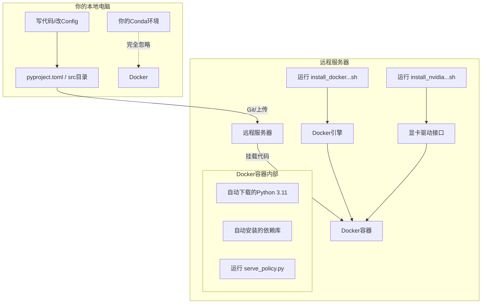

### Docker Setup

All of the examples in this repo provide instructions for being run normally, and also using Docker. Although not required, the Docker option is recommended as this will simplify software installation, produce a more stable environment, and also allow you to avoid installing ROS and cluttering your machine, for examples which depend on ROS.

- Basic Docker installation instructions are [here](https://docs.docker.com/engine/install/).
- Docker must be installed in [rootless mode](https://docs.docker.com/engine/security/rootless/).
- To use your GPU you must also install the [NVIDIA container toolkit](https://docs.nvidia.com/datacenter/cloud-native/container-toolkit/latest/install-guide.html).
- The version of docker installed with `snap` is incompatible with the NVIDIA container toolkit, preventing it from accessing `libnvidia-ml.so` ([issue](https://github.com/NVIDIA/nvidia-container-toolkit/issues/154)). The snap version can be uninstalled with `sudo snap remove docker`.
- Docker Desktop is also incompatible with the NVIDIA runtime ([issue](https://github.com/NVIDIA/nvidia-container-toolkit/issues/229)). Docker Desktop can be uninstalled with `sudo apt remove docker-desktop`.


If starting from scratch and your host machine is Ubuntu 22.04, you can use accomplish all of the above with the convenience scripts `scripts/docker/install_docker_ubuntu22.sh` and `scripts/docker/install_nvidia_container_toolkit.sh`.

Build the Docker image and start the container with the following command:
```bash
docker compose -f scripts/docker/compose.yml up --build
```

To build and run the Docker image for a specific example, use the following command:
```bash
docker compose -f examples/<example_name>/compose.yml up --build
```
where `<example_name>` is the name of the example you want to run.

During the first run of any example, Docker will build the images. Go grab a coffee while this happens. Subsequent runs will be faster since the images are cached.

你的直觉非常敏锐，这确实是初学者最容易混淆的一个概念。

直接给结论：**你描述的“项目代码 + 对应环境 + 依赖”打包在一起的那个东西，在 Docker 术语里，确实叫“镜像（Image）”，而不是“容器（Container）”。**

你可以用计算机专业最熟悉的 **“面向对象编程（OOP）”** 来瞬间理解这两者的关系：

### 1. 核心类比：类 (Class) vs 实例 (Object)

既然你是计算机专业的学生，这个比喻对你来说绝对是秒懂：

* **镜像 (Image) = 类 (Class)**
* 它是静态的定义。
* 它包含了所有的代码、属性（环境）、依赖库。
* 它是**只读**的模板，写好了就在那，不会自己动。
* *你说的“打包好的环境”，就是这个 Class。*


* **容器 (Container) = 实例 (Object/Instance)**
* 它是 `new Class()` 出来的产物。
* 它是动态的，是运行时的实体。
* **你可以用同一个镜像（类），启动 100 个不同的容器（实例）。**
* 每个容器虽然出身相同（镜像一样），但它们运行起来后，PID 不同、IP 不同、里面产生的临时数据也互不干扰。


---

### 2. 深入纠正你的“打包”概念

你提到：“*我的理解是项目代码加上对应的环境和依赖就是容器*”。

我们来修正一下这个流程：

1. **Dockerfile**：这是你的“图纸”。
2. **Build（构建）**：你执行构建命令，把代码、依赖、环境“烧录”成一个文件包。
* 👉 **这就叫【镜像 (Image)】**。
* 此时它静静地躺在你的硬盘里，占用几百 MB 的空间，它只是一个文件，不会消耗 CPU 和 内存。


3. **Run（运行）**：你输入命令 `docker run`。
* Docker 读取这个镜像文件。
* Docker 为它分配一个隔离的进程空间、网络空间。
* Docker 启动镜像里指定的程序（比如 `python main.py`）。
* 👉 **这就叫【容器 (Container)】**。
* 此时它开始消耗 CPU、内存，并且你可以登录进去操作它。


### 3. 为什么这个区分很重要？

理解了**“镜像 = 静态安装包”**，**“容器 = 运行时的程序”**，你就能明白为什么会有上一条关于“数据挂载”的讨论了：

* **因为镜像是只读的**：所以你无法直接修改镜像里的代码。你不能像改 Word 文档一样改镜像。
* **因为容器是临时的**：容器只是镜像运行起来的一个“影子”。如果你发现代码有 Bug，你不能光在影子上修补（虽然能勉强修，但不持久）。
* **正确的做法**：
1. 回到源代码。
2. 修改代码。
3. **重新打包**生成一个新的**镜像**（Image v2）。
4. 销毁旧的**容器**。
5. 用新的镜像启动一个新的**容器**。


### 总结

| 你的描述 | 准确术语 | 状态 | 类似于 |
| --- | --- | --- | --- |
| **“打包好的代码和环境”** | **镜像 (Image)** | 静态、只读、文件 | 游戏安装光盘 / Class / 剧本 |
| **“把它跑起来后的样子”** | **容器 (Container)** | 动态、可读写、进程 | 正在玩的游戏 / Object / 正在演出的戏剧 |

**这样理解的话，你现在清楚为什么我说“容器是用完即焚”的了吗？因为它只是根据剧本（镜像）临时搭的一个台子，剧本没变，台子随时可以拆了重搭。**

这是一个关于 **Docker 核心设计哲学** 的非常精准的描述。

简单来说，这句话是为了让你明白：**容器（Container）只是一个运行程序的“外壳”，它随时可能被替换；而数据（Data）是核心资产，必须放在“外壳”之外的安全地方。**

为了帮助你彻底理解，我们可以从**原理**、**场景**和**类比**三个层面来拆解：

---

### 1. 为什么是“用完即焚”？ (原理层面)

在 Docker 的设计中，容器被视为**不可变基础设施（Immutable Infrastructure）**的一部分。

* **分层存储机制：** Docker 镜像（Image）是**只读**的。当你启动一个容器时，Docker 仅仅是在只读的镜像上面盖了一层薄薄的**可读写层（Read-Write Layer）**。
* **生命周期：** 当你在容器里产生数据（比如由程序生成的日志、数据库存储的文件），这些数据默认是写在那层薄薄的“可读写层”里的。
* **毁灭的瞬间：** 一旦你执行 `docker rm` 删除容器，这个“可读写层”就会被彻底销毁。如果不挂载外部存储，这层里的所有数据也就随之**永久消失**了。

**这就叫“用完即焚”：** 容器本身被设计成可以随时被杀掉、随时被新版本替换的消耗品，而不是永久的存储介质。

### 2. 为什么要挂载到外部？ (场景层面)

“挂载到外部”通常指使用 **Docker Volumes (卷)** 或 **Bind Mounts (绑定挂载)**，将宿主机（Host）的磁盘空间映射给容器使用。

如果不这样做，你会遇到以下灾难性场景：

* **场景一：软件升级**
* 你运行了一个 MySQL 容器（版本 5.7）。
* 现在你想升级到 MySQL 8.0。
* **Docker 的做法是：** 删掉旧容器，启动一个新镜像的容器。
* **结果：** 如果没有挂载数据卷，你删掉旧容器的那一刻，数据库里所有的用户数据就全部丢失了。


* **场景二：容器崩溃**
* 容器因为报错意外退出了。为了修复，你可能需要重置环境。
* 如果你只是重启容器，数据还在；但如果你误删重建了容器，数据同样归零。


**通过挂载（Mapping）：**
我们将容器内的 `/var/lib/mysql`（数据库存数据的地方） 映射到宿主机的 `/data/mysql`。这样，即使容器爆炸了、删除了、升级了，**宿主机上的数据依然安然无恙**。新容器启动时，只要重新挂载这个目录，数据就“回来”了。

### 3. 通俗易懂的类比

为了更直观地理解，我们可以使用**“酒店房间 vs. 你的家”**的类比：

#### Docker 容器 = 酒店房间

* **用完即焚：** 酒店房间是标准化的（镜像）。你入住（启动容器），把房间弄乱、在桌子上摆满东西（写入数据）。当你退房（删除容器）后，清洁工会把一切恢复原状，你留下的东西会被清理掉，下一个客人看到的是一个全新的标准房间。
* **不持久：** 你不能指望下次入住时，你上次写的便签还在桌子上。

#### 挂载数据 = 自带保险箱

* **外部挂载：** 你带了一个自己的移动硬盘或保险箱（外部存储卷）。
* **持久化：** 你在酒店房间里工作时，产生的所有重要文件都存进了这个保险箱。
* **结果：** 哪怕你退房了，换了一家酒店（更换容器版本），只要你带着这个保险箱，你的数据就永远跟着你，不会丢失。

---

### 总结：如何正确操作？

理解了这句话，你在使用 Docker 时就应该遵循**“数据与应用分离”**的原则：

| 组件 | 性质 | 存放内容 | 处理方式 |
| --- | --- | --- | --- |
| **容器 (Container)** | **易失的** (无状态) | 应用程序代码、运行环境、依赖库 | 随时可以删除、重建、升级 |
| **卷 (Volume/Mount)** | **持久的** (有状态) | 数据库文件、配置文件、业务日志、用户上传的图片 | **必须**映射到宿主机，严加保护 |

**最后，你可以这样简单记忆：**

> **“铁打的数据，流水的容器。”**

---

你的理解非常到位！你的描述基本涵盖了 Docker 的**镜像（Image）**与**容器（Container）**的核心工作流。

为了让你对“数据到底存哪了”这个问题更放心，我把你的三个疑问拆解开来，补充一点底层的技术细节：

### 1. “容器就是我打包好的环境，里面东西是写死的？”

**是的，但准确来说，那个“写死”的东西叫【镜像 (Image)】。**

* **打包好的环境（镜像）：** 当你运行 `docker build` 时，你把代码、依赖库、系统环境打包成了一个**只读的**文件包。这就好比你把游戏刻录到了光盘里。
* **写死的含义：** 镜像一旦生成，里面的内容就不会变了。如果你想修改代码里的一行字，你就必须重新 `docker build` 生成一个新的镜像（新的光盘）。

### 2. “如果要更新，就需要销毁容器，重新打包部署？”

**完全正确。这是 Docker 最标准的“最佳实践”。**

虽然从技术上讲，你可以通过 `docker exec` 进入正在运行的容器里修改代码（像以前操作虚拟机一样），但**极度不推荐**这样做，因为：

1. **无法复现：** 你手动改了容器A，下次扩容启动容器B时，容器B还是旧代码。
2. **违背初衷：** Docker 的优势就是“环境一致性”。

**正确的更新流程确实是：**

1. 在开发机修改代码。
2. `docker build` 打包新镜像（比如 `v2.0`）。
3. `docker stop` & `docker rm` 删掉旧容器。
4. `docker run` 使用新镜像启动新容器。

### 3. “如果不挂载磁盘，数据存在哪里？销毁后也没了吗？”

这是你最关心的问题。

#### A. 数据存在哪里？（物理层面）

如果你没有挂载外部卷（Volume），容器里产生的数据（比如日志、数据库文件）**并不会凭空漂浮在内存里**，它们确实落在了服务器的物理磁盘上。

* **具体位置：** 它们通常存储在宿主机的 `/var/lib/docker/overlay2/` (Linux 下常见) 目录下的一堆由乱码命名的文件夹里。
* **机制：** Docker 使用一种叫 **OverlayFS** 的文件系统。它会在“只读的镜像层”上面盖一层“可读写的容器层”。你写入的数据，就存在这个**容器层**里。

#### B. 销毁后数据还在吗？

* **`docker stop` (停止容器)：** 数据还在。容器只是休息了，那层“容器层”文件还在磁盘上。
* **`docker rm` (删除容器)：** **数据彻底没了。**
* 当你执行删除命令时，Docker 会认为这个容器的生命周期结束了，它会直接删除掉宿主机上 `/var/lib/docker/overlay2/...` 下对应的那个文件夹。
* 这时候，你在容器里产生的所有数据（用户上传图、数据库记录）就**永久丢失**了，无法恢复。


---

### 总结图示

你可以把这个过程想象成**“复写纸”**原理：

1. **底下的书（镜像）：** 是你的代码和环境，印制好的，不能改（只读）。
2. **上面盖的透明纸（容器层）：** 容器运行时，所有的新增数据、修改记录，都是写在这张透明纸上的。
3. **不挂载的情况：** 当你扔掉这个容器（`docker rm`），你连同这张透明纸一起扔进了碎纸机。虽然底下的书（镜像）还在，但你在透明纸上写的字（数据）全没了。
4. **挂载的情况：** 你在透明纸上挖了个洞，把笔直接伸进去写在桌面上（宿主机磁盘）。这样把纸扔了，桌上的字还在。

### 既然如此，如何优雅地处理更新？

为了防止更新容器时丢失数据，我们通常在 `docker run` 时加一个 `-v` 参数：

```bash
# 格式： -v 宿主机路径:容器内路径
docker run -d \
  -v /home/user/project/data:/app/data \  <-- 关键！把数据锚定在外部
  -v /home/user/project/logs:/app/logs \  <-- 日志也导出来
  my-image:v2.0

```

这样，当你删除旧容器、换 `v3.0` 镜像启动新容器时，只要**继续挂载这几个目录**，新程序立马就能读到旧数据，实现“无缝升级”。

你的感觉**非常准确**。在深度学习（特别是涉及 GPU、特定 Python 版本和底层 C++ 库）的部署场景下，Docker 确实是**降维打击**般的更优解。

传统的“逐步在服务器上配置环境”（我们常称为 **裸机部署** 或 **Bare Metal**）和 Docker 部署的区别，可以用“**手工作坊 vs 工业流水线**”来比喻。

以下是具体的对比分析：

### 1. 环境隔离性 (最大的痛点)

* **裸机部署 (手动配置)**：
* **现状**：所有的软件都装在服务器的同一个系统里。
* **风险**：
* **依赖冲突 (Dependency Hell)**：你的项目 A 需要 Python 3.8 + PyTorch 1.12，而服务器上跑着的项目 B 需要 Python 3.11 + PyTorch 2.1。这两个往往不能共存（尤其是涉及到系统级的 CUDA 库时）。
* **污染系统**：你为了跑项目装了一堆 `apt-get install xxx`，项目跑完后你敢删吗？删了会不会把别人的项目搞挂？最后服务器变成了“垃圾堆”。


* **Docker 部署**：
* **现状**：每个容器都是一个独立的“小世界”。
* **优势**：OpenPi 的容器里装 Python 3.11.9，隔壁容器装 Python 3.8，它们**老死不相往来**。你可以随意删除容器，对服务器毫无残留。


### 2. 可复现性 (Reproducibility)

* **裸机部署**：
* **过程**：你看着 README，一条条敲命令。
* **问题**：“在我本地明明能跑，为什么服务器上报错？”
* **原因**：可能服务器上已经装了一个旧版的 `ffmpeg`，或者少了一个 `libGL.so`，或者 `glibc` 版本不对。这些隐性的系统级差异极难排查。


* **Docker 部署**：
* **优势**：`serve_policy.Dockerfile` 就是一份**精确的配方**。它明确指定了：
* 基础镜像：`nvidia/cuda:12.2.2-cudnn8...` (精确到 hash 值，连操作系统版本都锁死了)。
* 系统库：`git-lfs`, `linux-headers`, `clang` 等。
* Python 环境：强制安装 `3.11.9`。


* **结果**：只要配方不变，全世界任何一台装了 Docker 的机器跑出来的环境都**一模一样**。


### 3. 系统级依赖的处理

看你的 `serve_policy.Dockerfile` 第 11 行：

```dockerfile
RUN apt-get update && apt-get install -y git git-lfs linux-headers-generic build-essential clang

```

* **裸机部署**：你需要手动运行这行命令。如果服务器没有 `sudo` 权限，或者管理员不让你装这些底层编译器，你就卡住了。
* **Docker 部署**：这些只装在容器内部。你不需要求管理员给你装 `clang`，你自己在容器里想怎么装就怎么装。

### 4. 部署与回滚的速度

* **裸机部署**：
* **上线**：可能需要折腾半天配环境。
* **挂了**：如果不小心升级坏了某个包，想退回去非常痛苦，可能需要重装系统。


* **Docker 部署**：
* **上线**：`docker compose up -d`，几分钟内自动拉取并启动。
* **回滚**：发现新版镜像有问题？改一下 tag，一秒钟切回旧版镜像。


### 总结对比表

| 特性 | 裸机部署 (逐步配置) | Docker 部署 (容器化) |
| --- | --- | --- |
| **配置难度** | 高 (容易漏步骤，容易报错) | 低 (脚本自动化) |
| **环境纯净度** | 脏 (各种依赖混在一起) | 净 (用完即焚) |
| **迁移性** | 差 (换台服务器得重来一遍) | 强 (打包带走，到处运行) |
| **版本管理** | 难 (很难同时跑多版本) | 易 (多版本共存) |
| **系统侵入** | 高 (需要动系统库) | 低 (只依赖 Docker Engine) |

### 既然 Docker 这么好，为什么还有人手动配？

通常只有两种情况适合手动配：

1. **极简的开发环境**：你只是想写几行脚本测试一下，不想写 Dockerfile。
2. **特定的物理硬件调试**：涉及到非常底层的硬件驱动开发，容器隔离可能会带来麻烦。

**结论**：
对于你的 OpenPi 项目（复杂的深度学习栈 + 需要长期稳定运行），**坚持使用 Docker 绝对是正确的选择**。它能为你节省未来无数个“排查环境问题”的小时。


这一组文件共同构成了一个 **“容器化部署套件”**。

简单来说，之前的 `pip install -e .` 是在你的**本机（开发环境）里折腾，而这个 `docker` 目录是为了把整个 OpenPi 项目打包成一个独立的集装箱（容器）**，方便搬运到其他机器上运行，或者在服务器上稳定部署，而不用担心环境配置问题。

下面逐个文件为你解释它们的作用：

### 1. 环境准备脚本 (Setup Scripts)

这两个脚本是为了在一台**崭新的 Ubuntu 22.04 服务器**上快速准备好运行环境。

* **`install_docker_ubuntu22.sh`**
* **作用**：**一键安装 Docker 引擎**。
* **解释**：它包含了添加 GPG 密钥、配置官方软件源、安装 `docker-ce` 以及把当前用户加入 `docker` 用户组等一系列繁琐的 Linux 命令。你不需要去查 Docker 官网文档，运行这个脚本就行。
* **细节**：它还自动配置了 Docker 开机自启。


* **`install_nvidia_container_toolkit.sh`**
* **作用**：**让 Docker 能用显卡 (GPU)**。
* **解释**：光装 Docker 是不能调用 NVIDIA 显卡的。这个脚本安装了 `nvidia-container-toolkit`。这是连接 Docker 容器和宿主机显卡驱动的桥梁。如果不装这个，你在容器里跑模型会报错找不到 GPU。


### 2. 镜像构建文件 (The Blueprint)

* **`serve_policy.Dockerfile`**
* **作用**：**定义了“怎么打包”这个项目**。它是制作镜像的配方。
* **核心流程解析**：
1. **基础镜像**：`FROM nvidia/cuda:12.2.2...`，直接基于 NVIDIA 官方的 CUDA 镜像，省去了配置显卡驱动的麻烦。
2. **安装工具**：它安装了 `uv` (Astral 出品的超快 Python 管理器)，这和你之前在本地遇到的依赖问题呼应上了，项目组显然也推荐用 `uv` 来解决复杂的依赖。
3. **安装依赖**：它将 `pyproject.toml` 和 `uv.lock` 复制进去，并运行 `uv sync` 安装所有 Python 库。
4. **启动命令**：`CMD ... serve_policy.py`，说明这个镜像启动后，默认就是为了运行我们在上一个问题里分析过的“策略服务器”。


### 3. 编排启动文件 (The Controller)

* **`compose.yml`**
* **作用**：**一键启动服务**。
* **解释**：如果没有这个文件，你启动镜像可能需要输很长的一串命令（比如 `docker run -v ... -p ... --gpus all ...`）。`compose.yml` 把这些参数都写好了。
* **关键配置**：
* `build`: 告诉 Docker 去哪里找 Dockerfile。
* `volumes`: **这是重点**。
* `- $PWD:/app`：把当前代码目录直接挂载到容器里。这意味着**你修改本地代码，容器里会立即生效**，不需要重新打包镜像。
* `- ${OPENPI_DATA_HOME...}:/openpi_assets`：把之前 `compute_norm_stats.py` 生成的 `assets` 数据挂载进去，这样容器就能读取到统计数据和 Checkpoint 了。


* `deploy.resources...`: 明确申请使用 NVIDIA GPU。


### 总结：它们怎么配合使用？

假设你现在弄了一台新的服务器，想把 OpenPi 跑起来：

1. **准备环境**：
运行 `install_docker_ubuntu22.sh` 和 `install_nvidia_container_toolkit.sh`。
2. **启动服务**：
在 `scripts/docker` 目录下运行一条命令：
```bash
docker compose up --build

```


* Docker 会自动根据 `serve_policy.Dockerfile` 打包环境。
* 自动挂载你的代码和数据。
* 自动申请 GPU。
* 最后启动 `serve_policy.py`，你的服务就上线了。


这套东西是**工业级交付**的标准配置，比我们在 Conda 环境里手动 `python train.py` 要稳定和正规得多。

这是一个非常好的问题，触及了 Docker 容器化技术的核心价值。

简单来说：**Docker 就像是预制菜。**
你在本地（家里）把菜洗好、切好、调料配好，甚至连锅（运行环境）都准备好，打包装进一个“集装箱”。到了服务器（餐厅），只需要把集装箱打开，加热一下就能吃，完全不用管餐厅的灶台是不是和你家的一样。

下面针对你的四个疑问逐一拆解：

### 1. 怎么做到“不用担心环境配置”？（原理）

Docker 的核心魔法在于 **“隔离”** 和 **“重建”**。

* **隔离**：Docker 容器内部是一个独立的微型 Linux 系统。它不使用你服务器原本安装的 Python、CUDA 或 gcc。
* **重建**：它不是“复制”你本地的杂乱环境，而是根据 **配方（Dockerfile）** 从零开始搭建一个全新的、纯净的环境。

**比如：**
你在本地用的 Python 3.11.5，服务器上是 Python 3.8。

* **没有 Docker**：你的代码在服务器上跑不起来，因为版本不对。
* **有 Docker**：`serve_policy.Dockerfile` 里写了 `RUN uv venv --python 3.11.9`。Docker 会在容器里自动下载并安装 Python 3.11.9。你的代码只在容器里跑，根本不知道（也不在乎）外面的服务器装了什么。

---

### 2. 本地环境依赖会被打包吗？

**结论：完全不会。**

这是一个常见的误区。

* **你本地的 Conda 环境 (`openpi_311`)**：Docker **完全看不见**，也不会去打包它。哪怕你本地环境里装了一堆垃圾包，或者是坏掉的 `evdev`，都不会影响 Docker。
* **Docker 怎么装依赖？**：它是根据你项目里的 **`pyproject.toml`** 和 **`uv.lock`** 文件，在容器构建的过程中，**重新下载并安装**一遍所有依赖。

**证据**：
看 `serve_policy.Dockerfile` 的第 24-32 行，它把 `pyproject.toml` 和 `uv.lock` 复制进容器，然后运行 `uv sync` 命令从互联网下载依赖。

---

### 3. 子项目（软链接）怎么打包？

你提到的 `src/openpi` 是通过 `pip install -e .` 链接安装的，这在 Docker 里有两种处理方式，你的这个项目采用的是 **“运行时挂载 (Volume Mount)”** 的方式，非常灵活。

#### 这个项目的处理方式：

请看 `compose.yml` 文件：

```yaml
volumes:
  - $PWD:/app

```

* **机制**：这行配置的意思是，把**服务器当前目录（`$PWD`）** 直接“映射”到容器内部的 `/app` 目录。
* **效果**：
1. Docker 容器里虽然有一套独立的 Python 环境，但它运行的代码，实际上就是你**文件夹里的这份代码**。
2. 不需要把代码“拷死”在镜像里。你在服务器上改一行代码，重启容器立刻生效。
3. 至于 `pip install -e .` 的效果，`Dockerfile` 里通过 `uv sync` 已经在容器内部配置好了路径映射，让容器里的 Python 知道去 `/app/src` 找代码。


---

### 4. 远程服务器需要配置什么？本地需要做什么？

#### **本地需要做什么？**

你本地**什么都不需要做**，不需要装 Docker，也不需要打包。
你只需要把代码写好，确保 `pyproject.toml` 里的依赖是全的，然后把整个项目文件夹上传到服务器（通过 git 或 scp）。

#### **远程服务器需要配置什么？**

远程服务器需要做一个**“一次性”**的基础设施建设。这也正是你上传的那两个 `.sh` 脚本的作用：

1. **安装 Docker 引擎**：
运行 `install_docker_ubuntu22.sh`。这是为了让服务器有能力运行容器。
2. **安装 NVIDIA 容器工具**：
运行 `install_nvidia_container_toolkit.sh`。这是为了让 Docker 容器能穿透隔离，直接使用服务器的 **显卡 (GPU)**。
3. **启动**：
配置好上面两步后，你在服务器上进入项目目录，运行：
```bash
docker compose -f scripts/docker/compose.yml up --build

```


它就会自动根据 Dockerfile 下载环境、安装依赖、启动服务。

### 总结图示



**一句话总结：**
你把代码传上去，脚本（Dockerfile）会负责在服务器的集装箱里重新把环境搭建一遍，而服务器只需要装好 Docker 和显卡驱动这个“底座”就行了。


你的理解非常精准，**完全正确**！

Docker 的核心理念就是**“环境独立”**。容器里发生的一切（装 Python、装库、改配置）都只在容器内部生效，跟你的宿主机（无论是本地电脑还是服务器）的系统环境互不干扰。

下面针对你的具体疑问，我来逐一拆解：

### 1. 这些文件会被安装在哪里？（硬盘上的位置）

虽然容器里感觉像是一个完整的 Linux 系统，但实际上它们的文件并没有散落在你服务器的各个角落。

* **物理位置**：所有容器内的文件（Python 环境、依赖包、代码副本）最终都存储在 Docker 引擎管理的**一个特定目录下**。
* 在 Linux 服务器上，通常是 `/var/lib/docker/` 目录。
* 在 Windows/Mac 上，通常是在一个巨大的虚拟磁盘文件里（比如 `Docker.raw`）。


* **黑盒管理**：你平时不需要（也不建议）去这个目录下找文件。对你来说，这个目录就像一个**“黑盒子”**或者**“加密的压缩包”**，只有通过 `docker` 命令才能访问里面的内容。

### 2. 会不会影响服务器上其他的项目？（隔离性）

**绝对不会。这就是 Docker 最大的卖点。**

* **沙盒机制**：你可以把 Docker 容器想象成服务器上的一个**“密封舱”**。
* **互不干扰**：
* **容器 A**（你的 OpenPi）里装了 Python 3.11 和 PyTorch 2.1。
* **容器 B**（别人的项目）里装了 Python 3.8 和 TensorFlow 1.0。
* **宿主机**（服务器本身）里甚至根本没装 Python。
这三者可以完美共存，**完全不知道对方的存在**。你甚至可以在同一台服务器上启动 10 个一模一样的 OpenPi 容器，它们之间也不会打架。


### 3. 我在本地安装 Docker 能跑吗？（可移植性）

**能跑，而且效果和服务器上一模一样。**

只要你的本地电脑（Windows/Mac/Linux）安装了 **Docker Desktop**：

* **一致性**：因为 Dockerfile 是同一份配方，所以你在本地构建出来的镜像，和服务器上构建出来的镜像，里面的软件环境是**比特级一致（Bit-identical）**的。
* **“在我机器上能跑”**：彻底解决了“在我本地能跑，上传到服务器就报错”的千古难题。

### 4. 调用的硬件 CPU 和 GPU 都是一样的吗？

**是的，几乎没有性能损耗。**

* **CPU**：
Docker **不是**虚拟机（像 VMware/VirtualBox 那种）。虚拟机是模拟硬件，很慢；而 Docker 是**直接使用**宿主机的内核。
所以在容器里跑代码，CPU 的速度和直接在宿主机上跑是**一样快**的。
* **GPU (显卡)**：
这也是你上传的 `install_nvidia_container_toolkit.sh` 脚本的作用。
* **直通技术**：Docker 通过 NVIDIA Container Toolkit，打通了一条“隧道”，让容器内的代码可以直接调用宿主机的物理显卡。
* **性能**：损耗极低，基本等同于原生性能。
* **“独一份”吗？**：
* **硬件上**：是的，调用的就是你那块物理显卡（比如 RTX 4090）。
* **资源分配上**：如果不加限制，Docker 会尝试占用所有显存。你也可以在 `compose.yml` 里配置，比如只给这个容器用第一块显卡 (`device: 0`)，这样其他容器就可以用第二块显卡，互不抢占。


### 总结

Docker 就像是在你的电脑/服务器上盖了一座**隔音效果极好的“临时板房”**：

1. **建房材料（镜像）**：自带装修（环境配置），去哪里盖都一样。
2. **位置（存储）**：盖在特定区域（`/var/lib/docker`），不占你家客厅（系统盘）。
3. **水电（CPU/GPU）**：直接接你家的水电网，性能全开。
4. **拆迁（删除）**：项目不想要了？一条命令 `docker rm`，板房直接拆走，完全不留痕迹，不会把你家弄脏。

这是一个非常实际的工程问题。

答案是：**两个方案都可以**。

但根据你的项目特点（带有 CUDA 和 PyTorch 的深度学习环境），我**强烈建议你选择“上传代码到服务器打包”**（方案一）。

只有在服务器**完全不能联网**的情况下，才考虑“本地打包上传”（方案二）。

以下是两个方案的详细对比和操作步骤：

---

### 方案一：上传代码，在服务器上打包 (推荐 🌟)

这是最主流、最省事的方法。

* **原理**：你只上传几 MB 的代码文件，服务器利用它的超快网速去下载几 GB 的环境依赖（PyTorch, CUDA 等）。
* **优点**：传输快，不用担心本地和服务器 CPU 架构不同（比如 Mac M1 vs Linux x86）。
* **怎么做**：
1. **上传**：把你的项目文件夹（包含 `src`, `scripts`, `pyproject.toml` 等）通过 `scp` 或 `git` 传到服务器。
2. **构建并启动**：
在服务器上运行：
```bash
# 进入项目目录
cd /path/to/your/project
# 一键构建并启动
docker compose -f scripts/docker/compose.yml up --build

```


3. **结果**：服务器会自动读取 `Dockerfile`，下载依赖，构建镜像，然后启动。


---

### 方案二：本地打包好，直接上传镜像 (离线部署)

你想知道的“打包成一个文件直接传过去”，是这个流程。

#### 1. 本地需要做什么准备？

* **安装 Docker Desktop**：你的本地电脑（Windows/Mac）必须安装并运行 Docker Desktop。
* **硬盘空间**：预留 20GB+ 空间。深度学习的镜像非常大（CUDA + PyTorch + 依赖通常在 10GB 以上）。

#### 2. 打包好的文件是什么？在哪里？

Docker 的镜像默认是**没有实体文件**显示在你的文件夹里的，它存在于 Docker 的内部数据库里。你需要用命令把它**导出**成文件。

**操作步骤：**

* **Step 1: 本地构建镜像**
```bash
# 注意：一定要加 --platform linux/amd64
# 因为服务器通常是 x86 架构，如果你本地是 Mac M1/M2 或者是 Windows，不加这个参数服务器跑不起来！
docker build --platform linux/amd64 -t openpi_server -f scripts/docker/serve_policy.Dockerfile .

```


* **Step 2: 导出成文件 (Make it a file)**
构建完成后，运行命令把它变成一个压缩包：
```bash
docker save -o openpi_image.tar openpi_server

```


* **文件是什么**：`openpi_image.tar`
* **在哪里**：就在你当前执行命令的目录下。
* **大小**：非常大（可能 10GB+）。


* **Step 3: 上传到服务器**
```bash
scp openpi_image.tar user@your-server-ip:/tmp/

```


*(这一步会非常慢，因为文件太大了)*
* **Step 4: 服务器加载**
在服务器上执行：
```bash
docker load -i /tmp/openpi_image.tar

```


加载完后，你就可以像往常一样用 `docker run` 或 `docker compose` 启动了。

---

### 为什么我不推荐“本地打包”？

1. **文件太大，传输痛苦**：
* **上传代码**：只需要传 5MB 的代码，服务器自己去下 10GB 的依赖（服务器网速通常很快）。
* **上传镜像**：你需要从本地上传 10GB+ 的文件到服务器。如果你家里的上行宽带只有 30Mbps，传这个文件可能要几个小时。


2. **架构兼容性坑**：
* 如果你的电脑是 Apple Silicon (M1/M2/M3)，你打出来的包默认是 ARM 架构的。
* 服务器通常是 Intel/AMD (x86) 架构的。
* 把 ARM 的包传到 x86 服务器上，**完全跑不起来**，除非你构建时极其小心地使用了 `buildx` 和 `--platform` 参数。


### 总结建议

**不用折腾本地打包。**

1. 把代码文件夹复制到服务器。
2. 在服务器上运行 `docker compose -f scripts/docker/compose.yml up --build`。
3. 去喝杯咖啡，让服务器自己下载配置。这是最快、最稳的路径。

你的感觉**非常准确**。在深度学习（特别是涉及 GPU、特定 Python 版本和底层 C++ 库）的部署场景下，Docker 确实是**降维打击**般的更优解。

传统的“逐步在服务器上配置环境”（我们常称为 **裸机部署** 或 **Bare Metal**）和 Docker 部署的区别，可以用“**手工作坊 vs 工业流水线**”来比喻。

以下是具体的对比分析：

### 1. 环境隔离性 (最大的痛点)

* **裸机部署 (手动配置)**：
* **现状**：所有的软件都装在服务器的同一个系统里。
* **风险**：
* **依赖冲突 (Dependency Hell)**：你的项目 A 需要 Python 3.8 + PyTorch 1.12，而服务器上跑着的项目 B 需要 Python 3.11 + PyTorch 2.1。这两个往往不能共存（尤其是涉及到系统级的 CUDA 库时）。
* **污染系统**：你为了跑项目装了一堆 `apt-get install xxx`，项目跑完后你敢删吗？删了会不会把别人的项目搞挂？最后服务器变成了“垃圾堆”。


* **Docker 部署**：
* **现状**：每个容器都是一个独立的“小世界”。
* **优势**：OpenPi 的容器里装 Python 3.11.9，隔壁容器装 Python 3.8，它们**老死不相往来**。你可以随意删除容器，对服务器毫无残留。


### 2. 可复现性 (Reproducibility)

* **裸机部署**：
* **过程**：你看着 README，一条条敲命令。
* **问题**：“在我本地明明能跑，为什么服务器上报错？”
* **原因**：可能服务器上已经装了一个旧版的 `ffmpeg`，或者少了一个 `libGL.so`，或者 `glibc` 版本不对。这些隐性的系统级差异极难排查。


* **Docker 部署**：
* **优势**：`serve_policy.Dockerfile` 就是一份**精确的配方**。它明确指定了：
* 基础镜像：`nvidia/cuda:12.2.2-cudnn8...` (精确到 hash 值，连操作系统版本都锁死了)。
* 系统库：`git-lfs`, `linux-headers`, `clang` 等。
* Python 环境：强制安装 `3.11.9`。


* **结果**：只要配方不变，全世界任何一台装了 Docker 的机器跑出来的环境都**一模一样**。


### 3. 系统级依赖的处理

看你的 `serve_policy.Dockerfile` 第 11 行：

```dockerfile
RUN apt-get update && apt-get install -y git git-lfs linux-headers-generic build-essential clang

```

* **裸机部署**：你需要手动运行这行命令。如果服务器没有 `sudo` 权限，或者管理员不让你装这些底层编译器，你就卡住了。
* **Docker 部署**：这些只装在容器内部。你不需要求管理员给你装 `clang`，你自己在容器里想怎么装就怎么装。

### 4. 部署与回滚的速度

* **裸机部署**：
* **上线**：可能需要折腾半天配环境。
* **挂了**：如果不小心升级坏了某个包，想退回去非常痛苦，可能需要重装系统。


* **Docker 部署**：
* **上线**：`docker compose up -d`，几分钟内自动拉取并启动。
* **回滚**：发现新版镜像有问题？改一下 tag，一秒钟切回旧版镜像。


### 总结对比表

| 特性 | 裸机部署 (逐步配置) | Docker 部署 (容器化) |
| --- | --- | --- |
| **配置难度** | 高 (容易漏步骤，容易报错) | 低 (脚本自动化) |
| **环境纯净度** | 脏 (各种依赖混在一起) | 净 (用完即焚) |
| **迁移性** | 差 (换台服务器得重来一遍) | 强 (打包带走，到处运行) |
| **版本管理** | 难 (很难同时跑多版本) | 易 (多版本共存) |
| **系统侵入** | 高 (需要动系统库) | 低 (只依赖 Docker Engine) |

### 既然 Docker 这么好，为什么还有人手动配？

通常只有两种情况适合手动配：

1. **极简的开发环境**：你只是想写几行脚本测试一下，不想写 Dockerfile。
2. **特定的物理硬件调试**：涉及到非常底层的硬件驱动开发，容器隔离可能会带来麻烦。

**结论**：
对于你的 OpenPi 项目（复杂的深度学习栈 + 需要长期稳定运行），**坚持使用 Docker 绝对是正确的选择**。它能为你节省未来无数个“排查环境问题”的小时。